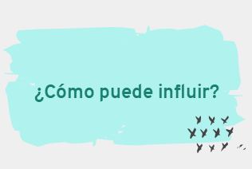
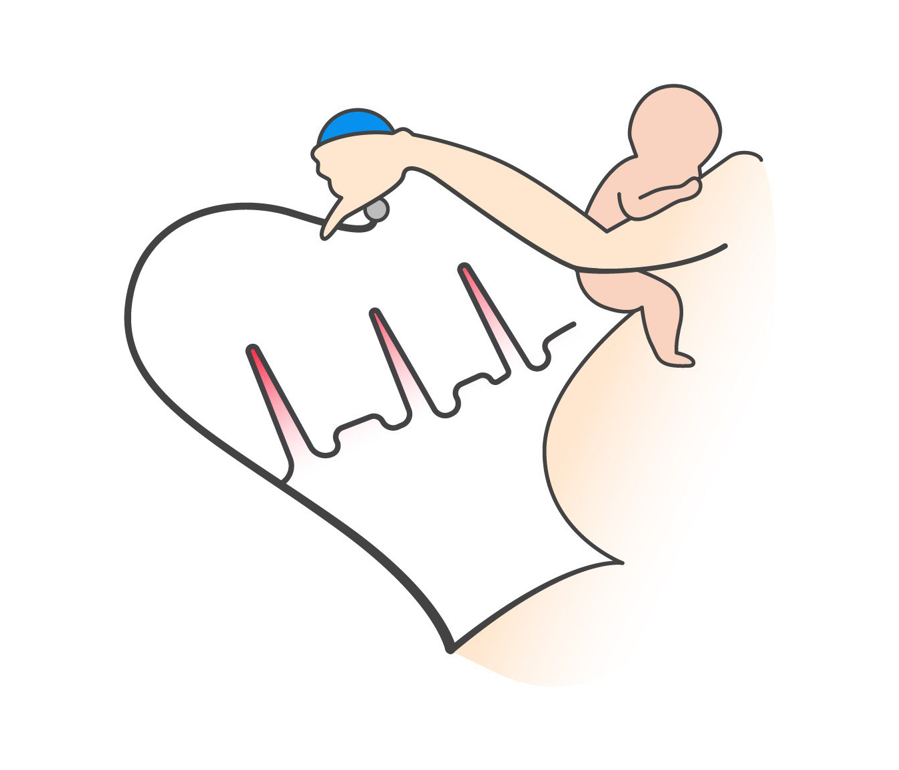

# Dando A Luz Una Idea

  

 

El parto...

  Es el proceso por el cual el ser humano sale del vientre de la madre y llega al mundo. En muchas culturas, visto como el <strong>inicio de la vida</strong> de una persona. Parte crucial entre el vínculo de una madre y su bebé. 
  Representa toda una experiencia para la misma madre y quienes estén presentes, incluyendo al bebé. Una experiencia que influye también posteriormente.

 

  

 

  Lastimosamente, hay miles de historias donde hasta detalles que podrian parecer insignificantes destacan en la memoria de la madre como recuerdos negativos. Estos pueden tener que ver con momentos antes del parto, el parto mismo o incluso en las etapas de recuperación. Llegando a influir enormente en temas como lo es incluso la desición de volverlo a experimentar. 
  Por el contrario, una buena experiencia puede tener implicaciones muy positivas. <strong>La mujer se siente más segura, disfruta el momento, se recupera mucho más rápido. El bebé, nace con niveles de estrés menores en su primer contacto con el mundo exterior.</strong>

 

  

 

Concretamente, <i>¿Qué nos hace novedosos?</i> 

  Los dispositivos desarrollados en esta área han sido más dirigidos al personal médico, al monitoreo y control; Cosa que esta bien. Sin embargo, hay tanta información valiosa, que no solo sirve para saber que la paciente está “fuera de peligro” o “progresando con normalidad”. Es información a tiempo real sobre ella, sobre el bebé, que siendo bien utilizada y procesada nos dice más de lo que se esta viendo superficialmente.
   
  Nuestra propuesta ofrece a las mujeres una alternativa no invasiva. Nada de un millón de cables monitoreandola, nada estándar ni rutinario. Algo más libre, de ellas y para ellas y su bebé.
   
  Todo con información que ya por sí mismas ellas nos están dando. Sintonizando cada aspecto a cómo su cuerpo vaya pasando por las etapas del parto, adecuando el ambiente a ella. 

 

   
  Somos un grupo de estudiantes de distintas áreas de la ingeniería inquietos por utilizar nuestro ingenio y creatividad para aportar un algo a la sociedad.  
  En este caso en particular motivados al saber que muchas mujeres tienen malos recuerdos de lo que debería ser uno de los más hermosos de su vida y al cual todos estamos relacionados de una u otra manera. Por lo <strong>“hemos dado a luz”</strong>,  esta hermosa propuesta. 

    

  

  <i>Improving your childbirth with love.</i>

___
___